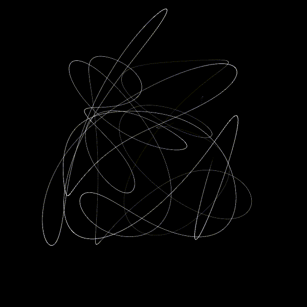

# Animations

I really admire the beauty that can be generated through math and enjoy the process of testing and tweaking functions and paramenters to achieve different outcomes in chaotic systems.
Inspired by Daniel Shiffman from [The Coding Train](https://thecodingtrain.com/) and Etienne Jacob [blueje](https://bleuje.com/) animations, I tried to design (or just reproduce) some perfect loop animations for fun.
Hope you enjoy and get inspired to do some yourself!

## Tools and references

- [Processing](https://processing.org/)
- [ffmpeg](https://www.ffmpeg.org/)
- [Easing functions](https://easings.net/)

### Sun's Surface

### Scribling

### DNA Synthesis

### Spark Emission

