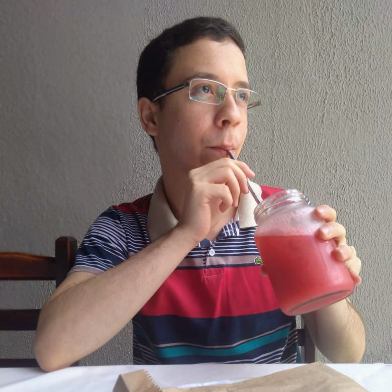

## About Me

Hi! I am a Phd student from [School of Electrical and Computing Engeneering (FEEC)](https://www.fee.unicamp.br) at State University of Campinas (UNICAMP), Brazil.
I got my degree in Electrical Engineering from São Paulo State University (UNESP) in 2021 and my master's degree in 2024 from UNICAMP.
Currently, I live with my wife and love to read, cook and knit on my free time.

## Research Interest

My current research focus on biologically inspired cognitive architectures, specially on the processes involving episodic memory.
I am also exploring means of object discovery for hierachical object segmentation through self-supervised learning.
As a research in the field of Artificial Intelligence, I dream of unveiling the misteries of how human minds function and how we can develop better agents to help (and not exploit) human kind.
